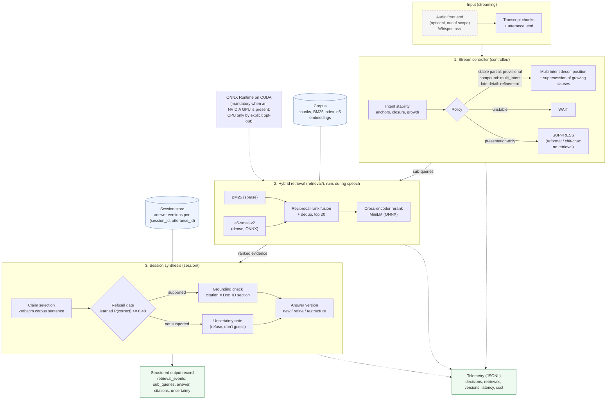

# Streaming Live RAG - architecture diagram (Mermaid)

Renders on GitHub and in the Mermaid live editor (https://mermaid.live): copy everything between the fences.
Component names match the code (`streaming_rag/...`); the design rationale is in `docs/architecture_brief.docx`.

